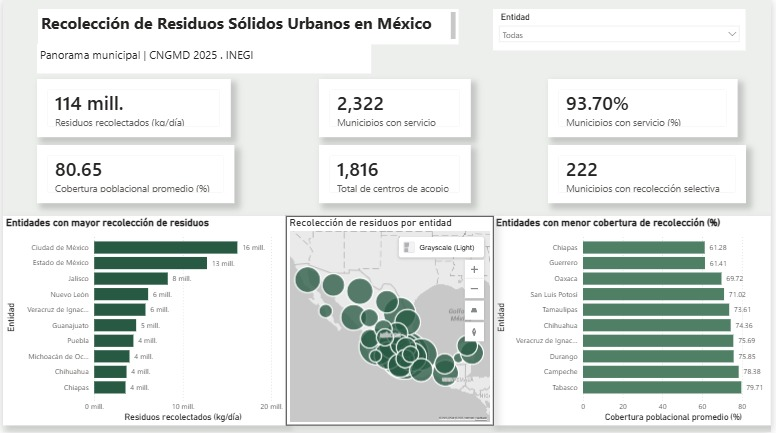
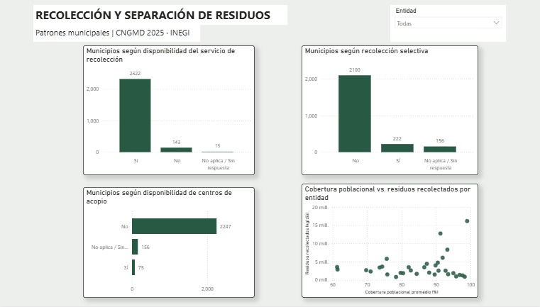
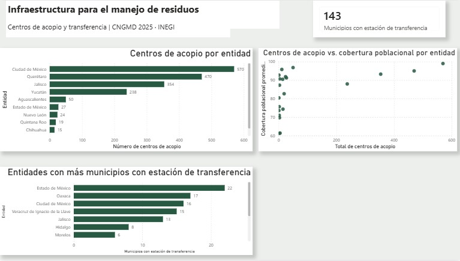

# Análisis de Residuos Sólidos Urbanos en México - Power BI
Proyecto de análisis y visualizaciones de datos elaborado en Power BI por medio de información del Censo Nacional de Gobiernos Municipales Y Demarcaciones Territoriales de la Ciudad de México (CNGMD) del año 2025 del INEGI. 
Mi objetivo con este proyecto fue analizar la cobertura de los servicios de recolección de los residuos sólidos urbanos en México, así como la implementación de recolección selectiva y la infraestructura disponible a nivel municipal y estatal. 
## Dashboard 
### 1. Resumen ejecutivo

En esta página vemos una visión general de la recolección de residuos sólidos urbanos en México por medio de indicadores clave, análisis territorial y un mapa interactivo.
Principales indicadores:
114.3 millones de kg de residuos recolectados diariamente. 
2,322 municipios y demarcaciones con servicio de recolección.
99.70% de los municipios cuentan con servicios. 
80.65% de cobertura poblacional promedio municipal.
222 municipios reportan recolección selectiva.
1,816 centros de acopio reportados. 
### 2. Recolección y separación

Esta página analiza la disponibilidad municipal de los servicios relacionados con la gestión de residuos.
Podemos ver:
Disponibilidad del servicio de recolección.
Implementación de recolección selectiva.
Disponibilidad de centros de acopio.
Relación entre cobertura poblacional y cantidad de residuos recolectados. 
### 3. Infraestructura para el manejo de residuos 

Esta página profundiza en la infraestructura disponible para la gestión de residuos.
Incluye: 
Centros de acopio por entidad.
Municipios con estaciones de transferencia.
Entidades con mayor presencia municipal de estaciones de transferencia.
Relación entre centros de acopio y cobertura poblacional.

## Principales hallazgos
El 93.70% de los municipios y demarcaciones incluidos en el conjunto de datos reportan servicio de recolección.
La recolección selectiva presenta una implementación considerablemente menos: 222 municipios reportan disponer de ella.
La infraestructura de centros de acopio presenta diferencia importantes entre entidades. 
Una mayor cantidad de centros de acopio no implica por sí sola una mayor cobertura poblacional de recolección; este dashboard permite explorar esta relación territorialmente.
Existen diferencias importantes entre entidades tanto en la cantidad de residuos recolectados como en la cobertura promedio del servicio.

## Preparación y transformación de datos
La preparación de los datos se realizó mediante Power Query
Las principales transformaciones fueron:
Selección de variables relevantes para el análisis.
Revisión y corrección de tipos de datos.
Tratamiento de valores nulos.
Corrección de campos numéricos utilizando configuración regional.
Construcción y normalización de claves geográficas.
Integración de catálogos de entidades y municipios.
Creación de tablas dimensionales para facilitar el análisis.

## Modelo de datos
Se construyó un modelo con tablas dimensionales para representar información geográfica y categorías relacionadas con la gestión de residuos. 
Entre las dimensiones utilizadas se encuentran:
Dim_Geografia
Dim_ServicioRecoleccion
Dim_RecoleccionSelectiva
Dim_EstacionTransferencia
Dim_CentroAcopio

Las relaciones permiten que los filtros que fueron aplicados sobre las dimensiones se propaguen hacia los datos utilizados por las medidas y visualizaciones. 

## DAX
Se desarrollaron medidas para calcular indicadores utilizados en el dashboard. 
Ejemplo:
Dax
Residuos Recolectados Kg Día =
SUM(servicio_cngmd2025[basu_ton]) * 1000
    + SUM(servicio_cngmd2025[basu_kgs])

Dax
Municipios con Servicio =
CALCULATE(
    COUNTROWS(servicio_cngmd2025),
    servicio_cngmd2025[serv_rec] = 1
)

Dax
Porcentaje Municipios con Servicio =
DIVIDE(
    [Municipios con Servicio],
    [Total Municipios],
    0)

El proyecto utiliza funciones y conceptos como SUM, AVERAGE, COUNTROWS, CALCULATE, DIVIDE y contexto de filtro.

## Herramientas y competencias
Power BI Desktop
Power Query
DAX
Modelado de datos
Relaciones entre tablas
Contexto de filtro
Segmentadores
Visualizaciones geográficas con Azure Maps
Gráficos de dispersión
Filtros Top N
Diseño de dashboards
Análisis exploratorio de datos

## Fuente de datos
Instituto Nacional de Estadística y Geografía (INEGI)
Censo Nacional de Gobiernos Municipales y Demarcaciones Territoriales de la Ciudad de México CNGMD 2025.
Los datos utilizados corresponden al módulo relacionado con la gestión de residuos sólidos urbanos.

## Objetivo del proyecto
Este proyecto forma parte de mi portafolio de análisis de datos y fue desarrollado para aplicar competencias de Power BI, partiendo de la transformación y modelado de datos hasta la creación de medidas DAX y dashboards interactivos.
